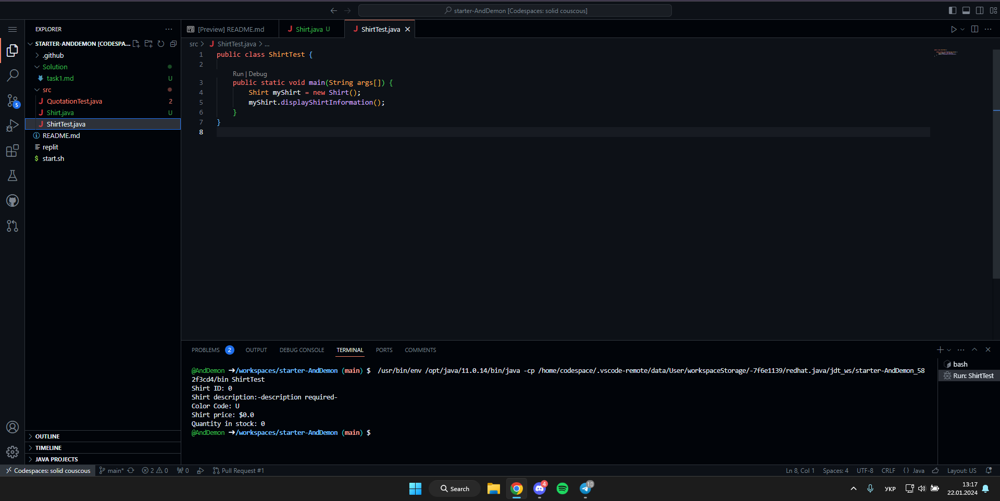
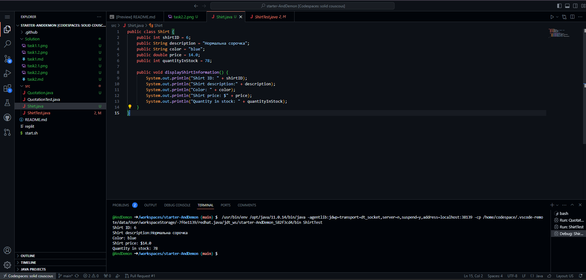

Завдання 1 - сорочки

task1.1:


```java
public class Shirt {
    public int shirtID = 0;
    public String description = "-description required-";
    public char colorCode = 'U';
    public double price = 0.0;
    public int quantityInStock = 0;

    public void displayShirtInformation() {
        System.out.println("Shirt ID: " + shirtID);
        System.out.println("Shirt description:" + description);
        System.out.println("Color Code: " + colorCode);
        System.out.println("Shirt price: $" + price);
        System.out.println("Quantity in stock: " + quantityInStock);
    }
}
```
task1.2:


```java
public class Shirt {
    public int shirtID = 6;
    public String description = "Нормальна сорочка";
    public String color = "blue";
    public double price = 14.0;
    public int quantityInStock = 78;

    public void displayShirtInformation() {
        System.out.println("Shirt ID: " + shirtID);
        System.out.println("Shirt description:" + description);
        System.out.println("Color: " + color);
        System.out.println("Shirt price: $" + price);
        System.out.println("Quantity in stock: " + quantityInStock);
    }
}
```