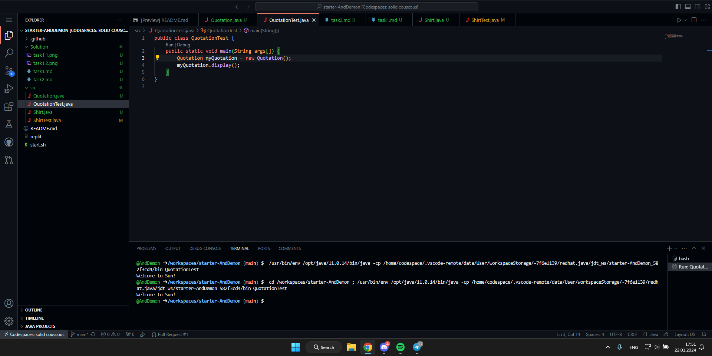

Завдання 2 - цитати

task2.1:


```java
public class Quotation {
  String quote = "Welcome to Sun!";
  public void display() {
    System.out.println(quote);
  }
}
```
task2.2:


```java
public class Quotation {
    String quote = "With big power comes big responsibility.";
    String author = "Uncle Ben";
    public void display() {
        System.out.println(quote+"\n\t\t\t"+author);
    }
}
```